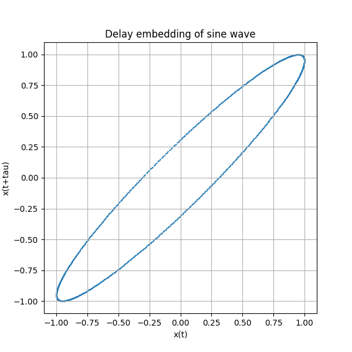
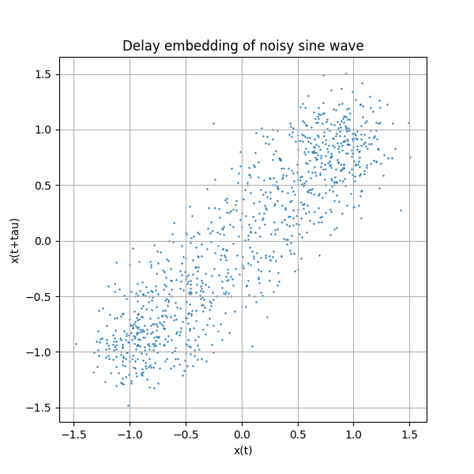

# Day 8 - Delay Embedding and Signal Geometry

## Today's objective

Today I am trying to understand how a 1D signal can be turned into a 2D shape using delay embedding.

The basic idea is simple:

$$
x(t) \rightarrow \big(x(t), x(t+\tau)\big)
$$

Instead of only looking at the signal value now, I also compare it with the value after a small delay.

## Clean sine wave

For a clean sine wave:

$$
x(t) = A\sin(2\pi ft)
$$

where:

- $A$ is amplitude
- $f$ is frequency
- $t$ is time

The delay embedding is:

$$
\big(x(t), x(t+\tau)\big)
$$

For a periodic signal like a sine wave, this creates a smooth loop-like shape.

## Noisy sine wave

If noise is added:

$$
y(t) = x(t) + n(t)
$$

then the delay embedding becomes less clean:

$$
\big(y(t), y(t+\tau)\big)
$$

The main circular structure is still visible, but the points are scattered because of the noise.

## Why this matters

Delay embedding helps reveal hidden structure in a signal.

In normal time-domain plots, the signal is just a wave. But in embedding space, repeated behavior becomes geometry. A clean periodic signal forms an organized shape, while noise or jamming makes the shape thicker, scattered, or broken.

This is useful for wireless signal analysis because some interference patterns may not be obvious in only the time domain or frequency domain.

## Detailed theory

### 1. From signal to geometry

A signal is usually written as a function of time:

$$
x(t)
$$

In a normal time-domain plot, the horizontal axis is time and the vertical axis is amplitude.

Delay embedding changes the view. Instead of plotting amplitude against time, I plot the signal against a delayed copy of itself:

$$
\big(x(t), x(t+\tau)\big)
$$

So every time value creates one point in a 2D plane:

$$
X(t) = x(t)
$$

$$
Y(t) = x(t+\tau)
$$

This means a time signal becomes a geometric curve.

### 2. Sine wave delay embedding

For a clean sine wave:

$$
x(t) = A\sin(2\pi ft)
$$

The delayed signal is:

$$
x(t+\tau) = A\sin(2\pi f(t+\tau))
$$

Expanding the inside:

$$
x(t+\tau) = A\sin(2\pi ft + 2\pi f\tau)
$$

The delay creates a phase shift:

$$
\phi = 2\pi f\tau
$$

So the embedding compares:

$$
\sin(\theta)
$$

with:

$$
\sin(\theta + \phi)
$$

where:

$$
\theta = 2\pi ft
$$

This is why the delay embedding of a pure sine wave becomes a closed curve.

### 3. Why the curve is an ellipse

The embedding point is:

$$
\big(\sin(\theta), \sin(\theta+\phi)\big)
$$

Both coordinates are sinusoidal and have the same frequency. The only difference is the phase shift $\phi$.

Different phase shifts produce different shapes:

- $\phi = 0$: both coordinates are equal, so the plot is a diagonal line.
- $\phi = \frac{\pi}{2}$: the signals are quarter-period apart, so the plot becomes circle-like.
- $\phi = \pi$: the delayed signal is opposite in phase, so the plot is a negative diagonal line.
- Other values of $\phi$: the plot becomes an ellipse.

So the circle is only a special case. Most delay values produce an ellipse.

### 4. Why frequency changes the ellipse

One observation from the animation was:

If $\tau$ is fixed and frequency changes, the ellipse also changes.

This is expected because:

$$
\phi = 2\pi f\tau
$$

The shape depends on phase shift $\phi$.

If $\tau$ is constant but $f$ changes, then $\phi$ changes. That means the delayed signal is now shifted by a different fraction of the wave cycle.

So the same delay can mean different things for different frequencies:

- For low frequency, the delay may be a small fraction of one cycle.
- For high frequency, the same delay may be a larger fraction of one cycle.

That is why changing frequency changes the ellipse.

### 5. Noise in delay embedding

For a noisy signal:

$$
y(t) = x(t) + n(t)
$$

the embedding becomes:

$$
\big(y(t), y(t+\tau)\big)
$$

or:

$$
\big(x(t)+n(t), x(t+\tau)+n(t+\tau)\big)
$$

The clean signal still has an underlying loop, but noise pushes the points away from the perfect curve.

So the embedding becomes:

- clean and thin when noise is low
- thick or scattered when noise is moderate
- broken or cloud-like when noise is strong

### 6. Wireless interpretation

Wireless signals are time-series data. Usually I analyze them using:

- time-domain plots
- frequency-domain FFT plots
- energy or power measurements

Delay embedding gives another view of the same signal:

$$
\big(x(t), x(t+\tau)\big)
$$

This view helps show whether the signal has stable repeated structure.

Examples:

- A clean periodic signal forms a clean loop.
- A noisy signal forms a thick loop.
- A distorted signal forms an irregular loop.
- A jammer may break, scatter, or deform the signal geometry.

So delay embedding can be useful for identifying hidden structure in wireless signals.

### 7. Try out this fun animation 

<iframe src="notes_animation.html" width="100%" height="520"></iframe>
