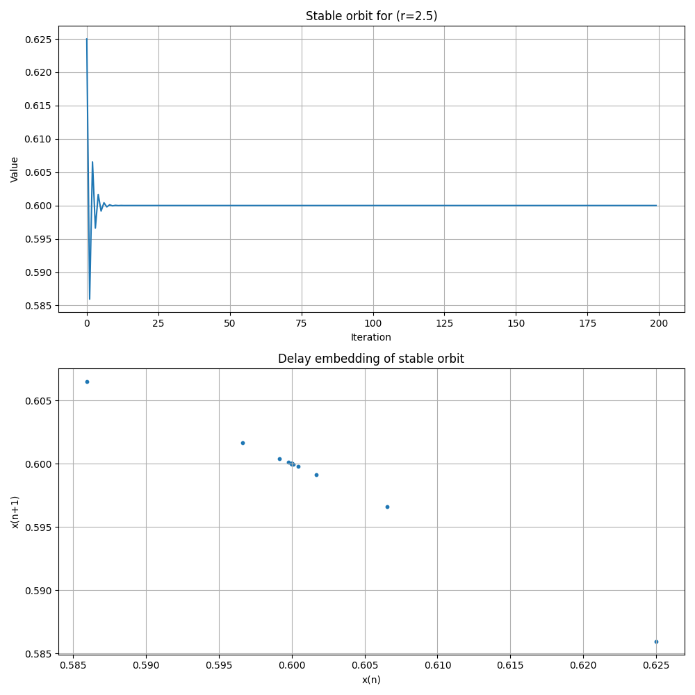
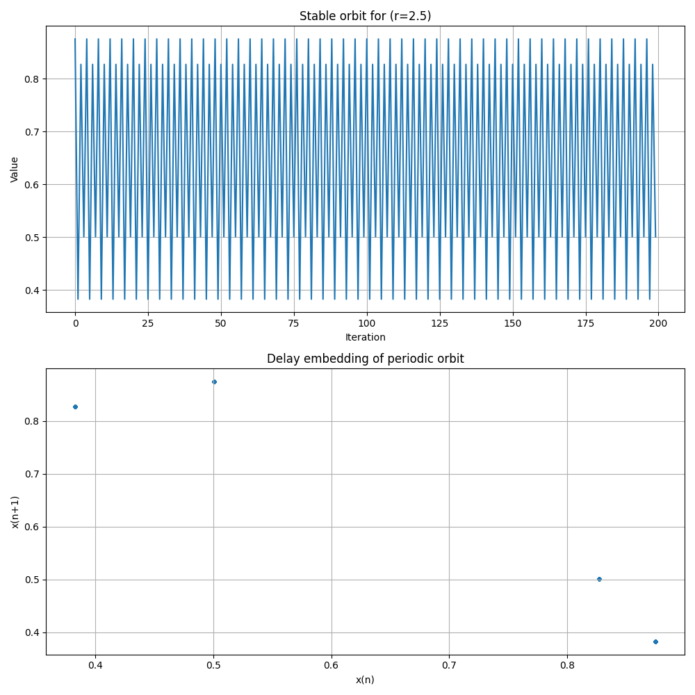
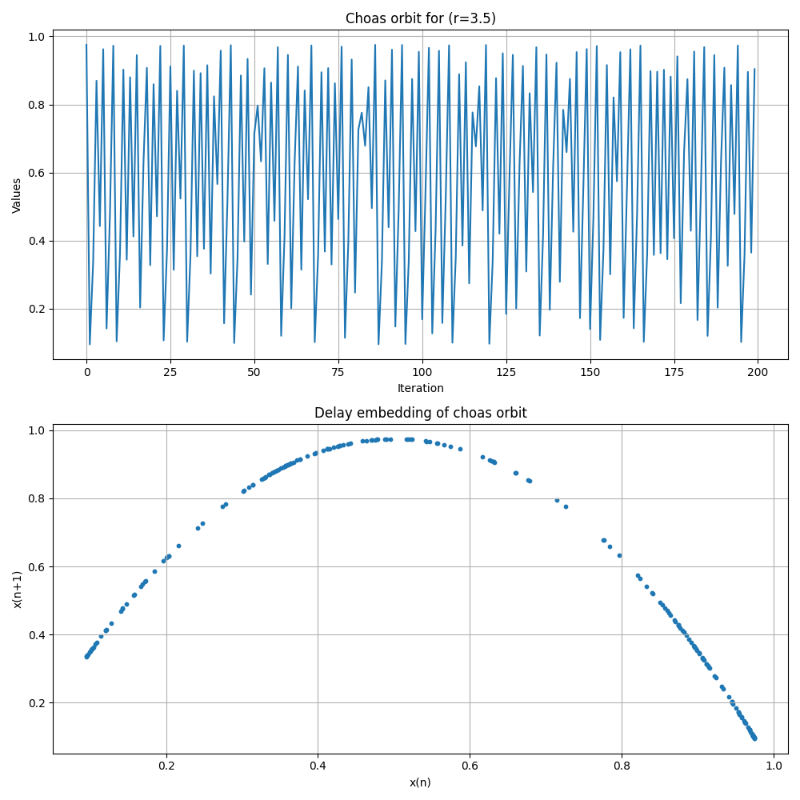
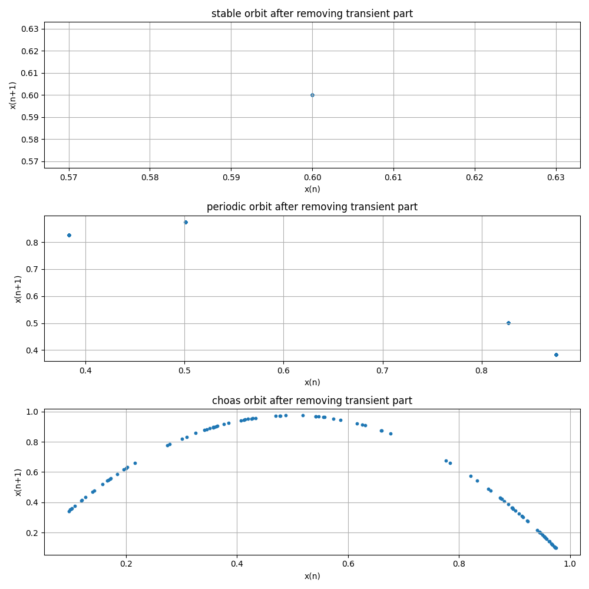
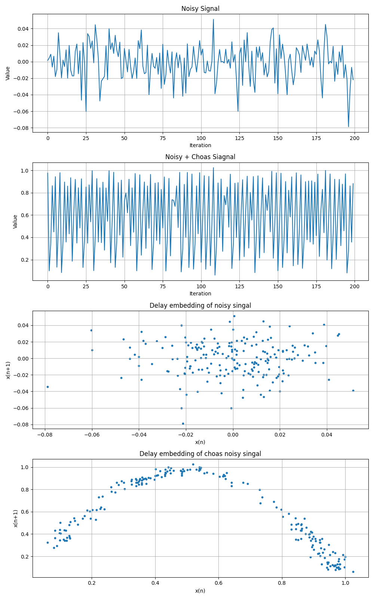

# Today's Objective

Today, I explored how the parameter $r$ fundamentally influences the behavior of the **Logistic Map**.

The governing equation is:

$$x_{n+1} = r \cdot x_n (1 - x_n)$$

This equation defines a discrete-time dynamical system. By varying $r$, we can observe dramatic transitions in the system's evolution. I have plotted the results for three specific values of $r$, comparing their time-series trajectories to visualize these behavioral shifts.

## Visualizations

- At **$r = 2.5$**, the system exhibits **stable behavior**, quickly converging to a fixed steady-state value of approximately $0.6$.
- Increasing the parameter to **$r = 3.5$** causes the system to settle into a **periodic orbit**, where it oscillates consistently between distinct values.
- At **$r = 3.9$**, the system enters a state of **chaos**, characterized by highly irregular, non-repeating, and seemingly random trajectories.

## Delay Embedding Analysis (Post-Transient)

By removing the initial transient phases, the delay embedding space reveals the long-term attractor of the system more clearly.

After filtering out the transients, we can observe the transition from a single fixed point (stability) to a discrete set of points (periodicity) and finally to a complex, structured attractor (chaos).

## Chaotic Signal Analysis with Noise

In this section, I examined the system when the chaotic signal $x_n$ is corrupted by additive noise $\eta_n$, resulting in the observed signal $y_n$:

$$y_n = x_n + \eta_n$$

By analyzing the signal mixed with noise, we observe that the delay embedding for pure noise exhibits random behavior with no discernible geometric pattern. However, when the chaotic signal is present, the delay embedding still reveals a underlying parabolic structure. This suggests that even in the presence of noise, the deterministic core of the chaotic system can be visually identified, as the fundamental geometry of the attractor is preserved.
