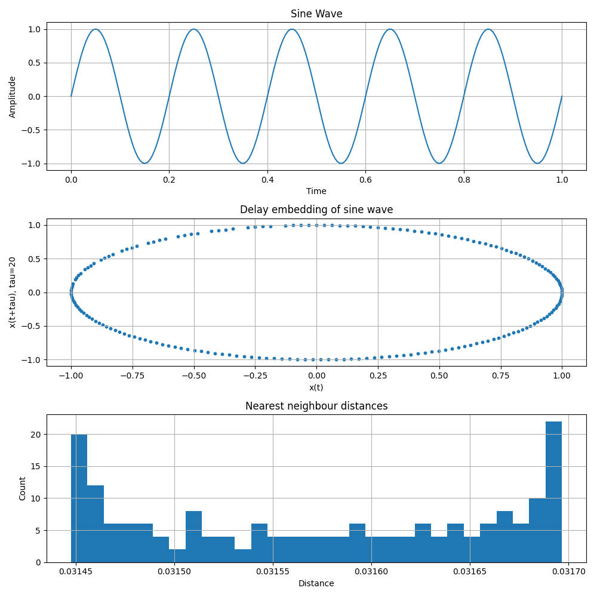
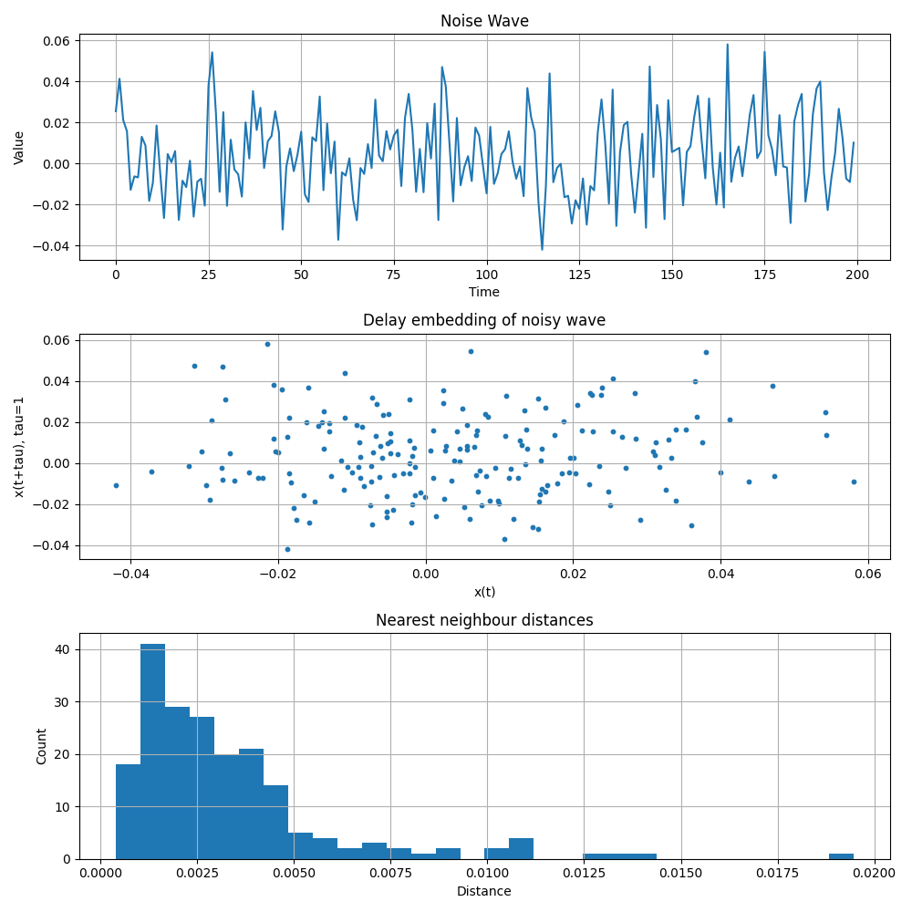
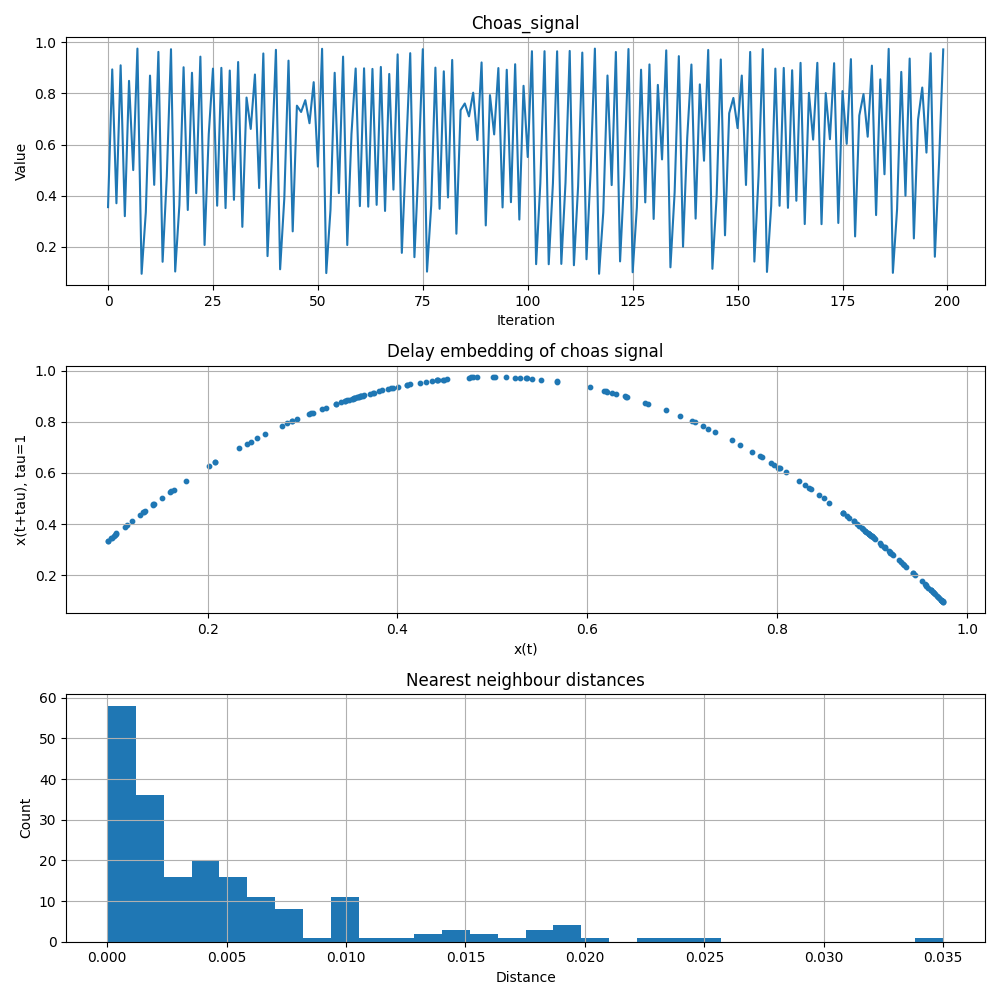

# Today's Objective:
Today I watched the histogram of nearest neighbors to identify how the points are distributed in space $(x(t),x(t+\tau))$.

# Theory:

First of all, the signal is transformed into a higher-dimensional space with x-coordinates $x(t)$ and y-coordinate $x(t+\tau)$. This is known as delay embedding. So far we know we can see the geometry of some wave and via geometric patterns we can know some behavior of the signal, like whether the signal is periodic or oscillating. Now we are analyzing how the points are spread in this space by taking the nearest neighbor. Let's say points which are mapped into this space are defined as $p_i = (x_i,y_i)$ where $i$ is from $1,2, \dots, N$. The points $p_k = (x_k,y_k)$ and $p_j = (x_j, y_j)$ are apart from each other by the distance $d(p_j, p_k) = \sqrt{(x_j - x_k)^2 + (y_j - y_k)^2}$. We take the distance from $p_k$ to every other $i$ where $k \neq i$, and the nearest neighbor distance is $d_{min}(p_k, p_i)$. Finally, we looked at the mean and deviation of the nearest distance.

# Observation:

The above images shows the delay embedding in 2d space along with the histogram of nearest neighbour and suggest that:
- For the sine wave, almost all neighbors are spread equally with a mean of **0.03157** and with the deviation of **8.75e-05**.
- Distances vary; however, distances are small. Noise has a mean variation of **0.00328** and a deviation of **0.0027**.
- The chaos signal has nearest neighbor distances spread widely, with the largest deviation of the three **0.0057** and a mean of **0.00483**.
