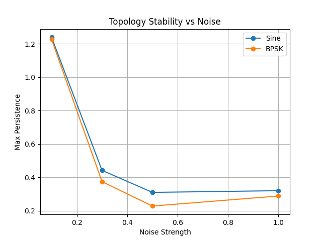

# Day 24 Observation: 

Today for two signal, starting from basic signal the sine wave and later to the bpsk signal, upon the addition of noise for different strength, I observed how the homology changes in the embedding space. 

# Some theory and background knowledge: 
A signal let's say defined for by the equation of $X(t)$ is firstly with the suitable value of $\tau$ is made to point cloud which has the cordinates $(X(t), X(t -\tau))$. This is also known as 2d delay embedding of the signal. Using these point clouds we firstly created a rips complex by expanding the radius around each point and analyzed the homology features especially $H_1$ which represents the one dimensinal_holes and loops. 

# A more insights from yesterday's experiment: 
On day 23 we observed how for different value of $\tau$ the plot looks on embedding space and furthermore for the sampling value of $200$ samples the sine wave produced a perfect circle for $\tau = 10$.

and for bpsk signal similarly for $\tau=5$ produced a clean circular topological embedding.

## Todays observation 
The experiments today were done for the $\tau = 10$ for sine wave and for BPSK signal $\tau=5$. The dominant $H_1$ loop was observed and furthermore the ratio of primary dominant loop and secondary domainant loop were observed. The result is shown below:

### How the embedding spaces evolved and persistence diagram changed as noise strength increased both for bpsk and sine wave?

#### Sine Wave
| Noise = 0.1 | Noise = 0.3 | Noise = 0.5 | Noise = 1.0 |
|:---:|:---:|:---:|:---:|
|  |  |  |  |
|  |  |  |  |

#### BPSK Signal
| Noise = 0.1 | Noise = 0.3 | Noise = 0.5 | Noise = 1.0 |
|:---:|:---:|:---:|:---:|
|  |  |  |  |
|  |  |  |  |

### Quantitative analysis

| Signal Type | Noise Level | # H₁ Features | Strongest Persistence | Second Strongest Persistence | Ratio of strongest to second strongest |
|-------------|-------------|---------------|----------------------|------------------------------|--------------------|
| Sine Wave   | 0.1         | 30            | 1.2389               | 0.0632                       | 19.57              |
| Sine Wave   | 0.3         | 40            | 0.4425               | 0.1274                       | 3.47               |
| Sine Wave   | 0.5         | 52            | 0.3106               | 0.2491                       | 1.25               |
| Sine Wave   | 1.0         | 43            | 0.3208               | 0.2379                       | 1.35               |

| Signal Type | Noise Level | # H₁ Features | Strongest Persistence | Second Strongest Persistence | P1/P2 Ratio |
|-------------|-------------|---------------|----------------------|------------------------------|--------------------|
| BPSK Signal | 0.1         | 92            | 1.2270               | 0.0729                       | 16.82              |
| BPSK Signal | 0.3         | 113           | 0.3750               | 0.1351                       | 2.77               |
| BPSK Signal | 0.5         | 124           | 0.2287               | 0.2269                       | 1.01               |
| BPSK Signal | 1.0         | 120           | 0.2887               | 0.2753                       | 1.05               |

### How the value of maximum persistence evolved over the value of different noise strength.

This graph clearly indicates as noise strength($\sigma \uparrow$) increases, the maximum $H_1$ persistence decreases. It clearly indicates that the topological structure(dominant loop) becomes less stable under perturbation. 

