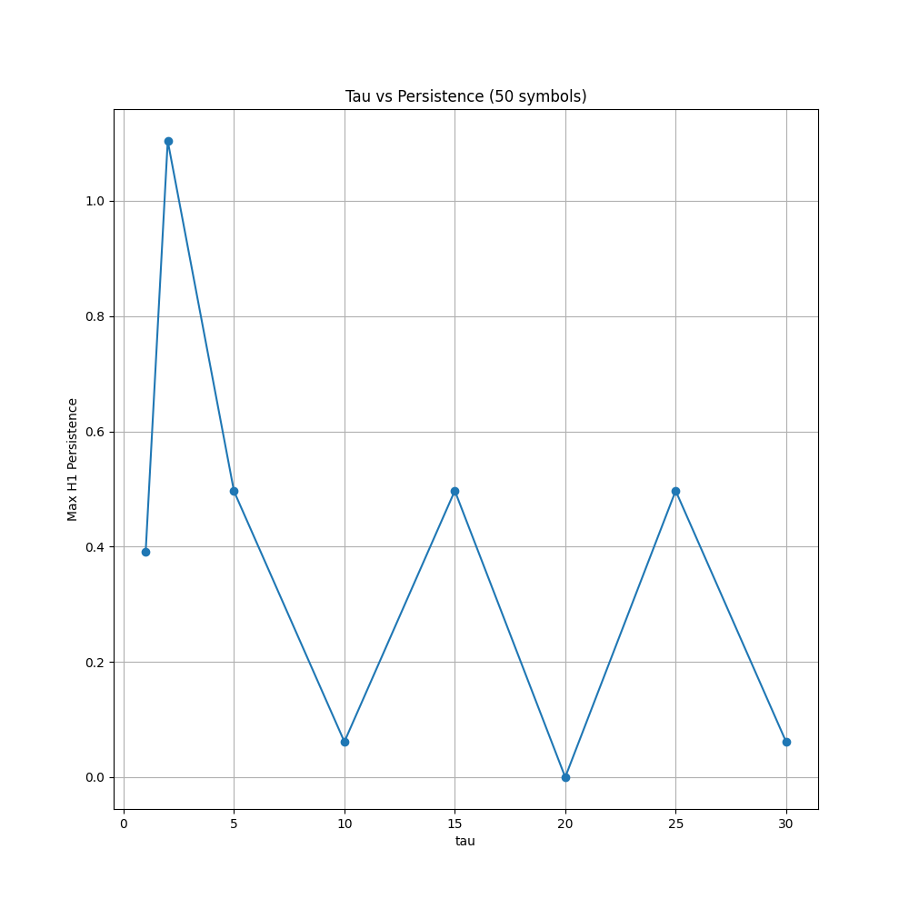
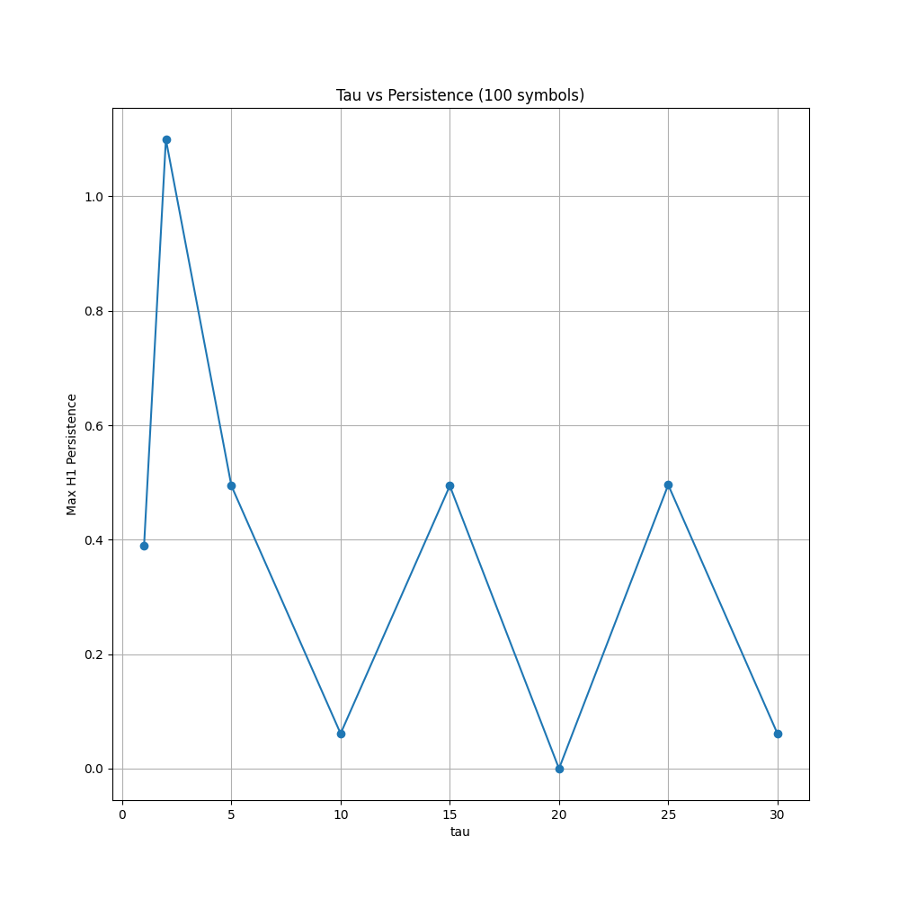
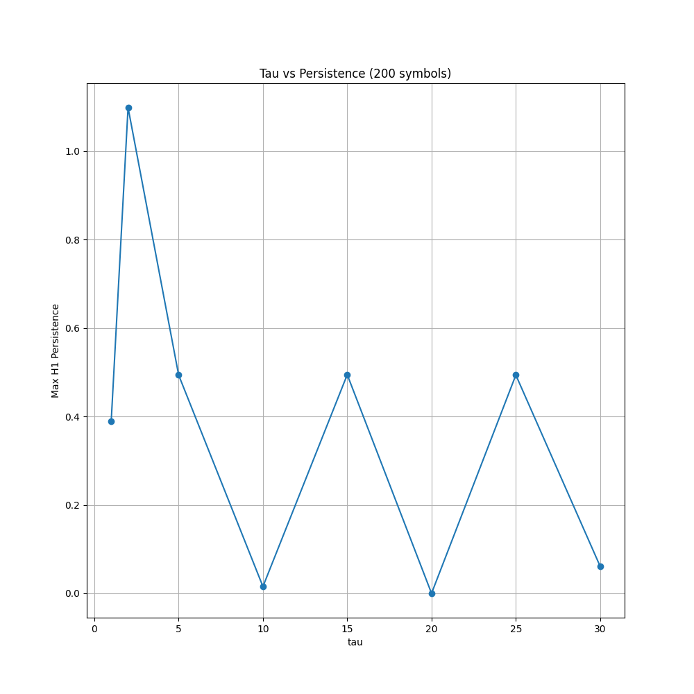
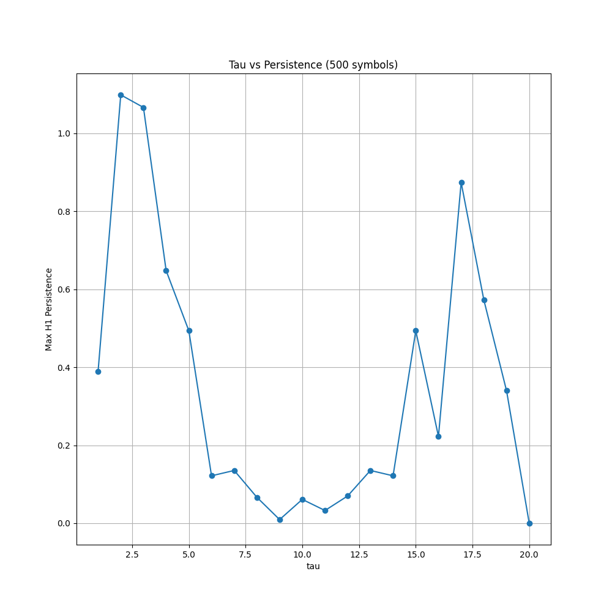
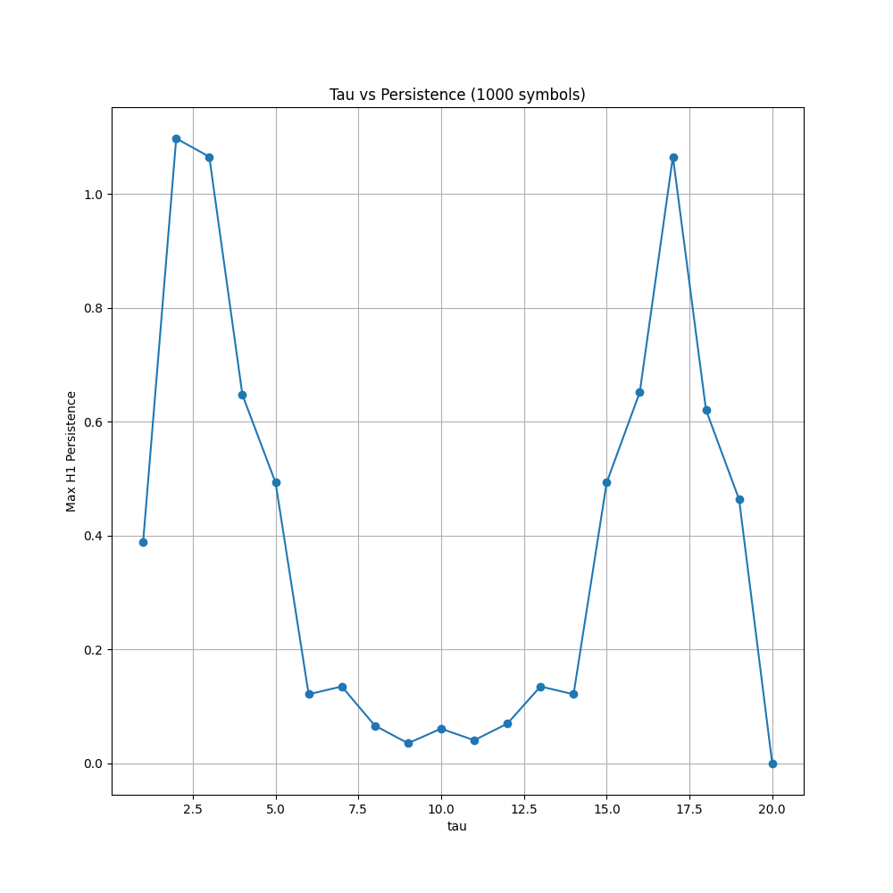
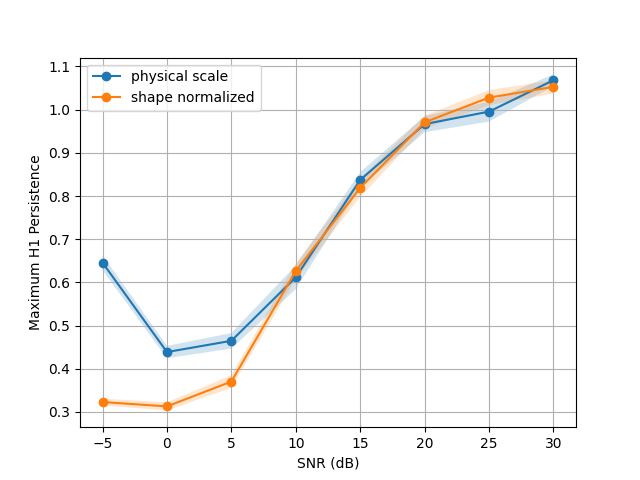
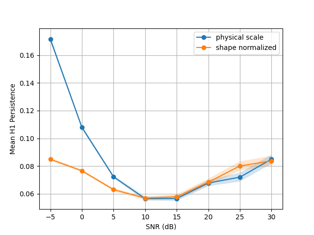
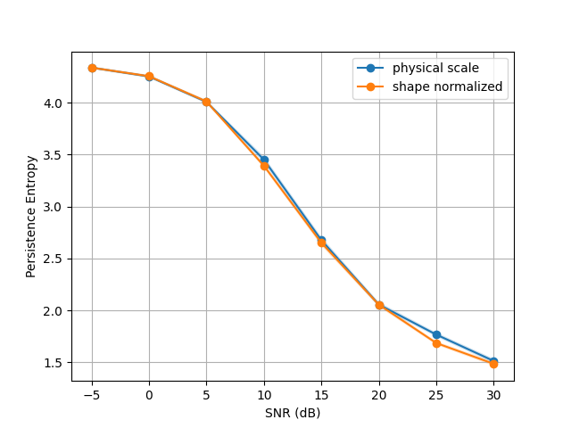
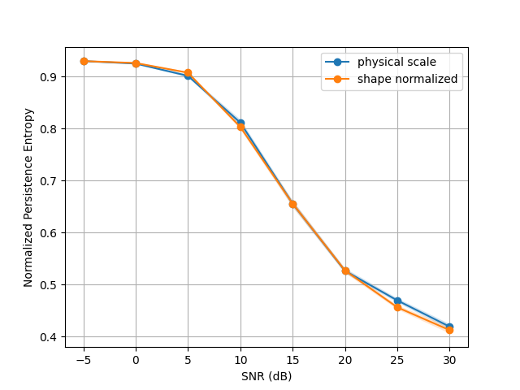
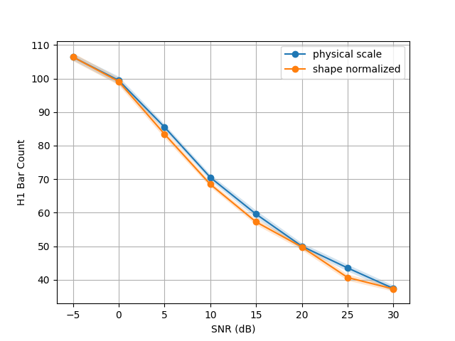

# Topological Analysis of QPSK Under AWGN

Date: 2026-06-23  
Project: QPSK delay embedding and persistent homology under SNR degradation

## Executive Summary

This experiment studies whether persistent homology features extracted from a delay-embedded QPSK waveform change systematically with additive white Gaussian noise (AWGN). The core idea is reasonable: clean pulse-shaped QPSK has structured geometry in delay space, while noise should disrupt that structure. However, the original experimental design had several weaknesses that made the interpretation too strong.

The most important issues were:

- The delay parameter `tau=2` was selected using the same persistence objective later used for evaluation.
- The noisy signal was normalized after AWGN injection, which changes the geometric scale of the point cloud.
- The same clean symbol stream was reused across seed runs.
- Raw persistence entropy was reported without normalizing for the number of H1 bars.
- Results were aggregated as means of pre-averaged summaries rather than saved at trial level.
- The pulse shaping model is a simplified Gaussian filter, not a communications-standard baseline.

The implementation has now been revised to make the analysis more defensible. The corrected experiment records trial-level observations, regenerates the clean symbol stream per seed, compares two normalization modes, and reports additional topology diagnostics: normalized entropy and H1 bar count.

## Experimental Pipeline

The pipeline is:

1. Generate random QPSK symbols.
2. Pulse-shape the symbols with a Gaussian kernel.
3. Normalize the clean waveform.
4. Add AWGN at a target SNR.
5. Optionally normalize the noisy waveform again.
6. Build a complex delay embedding:

```text
z[n] -> (Re z[n], Im z[n], Re z[n+tau], Im z[n+tau])
```

7. Randomly subsample the embedded point cloud.
8. Compute H1 persistent homology using a Vietoris-Rips complex.
9. Extract summary features:

- maximum H1 persistence
- mean H1 persistence
- raw persistence entropy
- normalized persistence entropy
- number of H1 bars

## Delay Parameter Selection

The tau sweep indicated that `tau=2` gives the largest maximum H1 persistence for the clean signal across multiple symbol counts.











This is useful as an exploratory result, but it is not enough to justify fixing `tau=2` without further validation. Since `tau` was selected by maximizing the same persistence feature later used to evaluate SNR, the experiment risks optimistic tuning.

Recommended fix:

- Keep `tau=2` as the main setting, but report sensitivity across nearby values such as `tau in {1, 2, 3, 4, 5}`.
- Select tau on a separate clean validation set, then evaluate SNR behavior on independently generated symbol streams.
- Report whether the monotonic trend survives when tau is not optimized.

## Corrected SNR Experiment

The corrected script is `02_snr_analysis.py`.

The revised experiment uses:

- `SEEDS = [0, 1, 42, 100]`
- `TRIALS = 10`
- `SNRs = [30, 25, 20, 15, 10, 5, 0, -5]`
- `MAX_POINTS = 200`
- `TAU = 2`
- two normalization modes:
  - `shape_normalized`: normalize the noisy signal after AWGN.
  - `physical_scale`: do not normalize the noisy signal after AWGN.

The main output files are:

- `results/snr_experiment_qpsk_trials.csv`
- `results/snr_experiment_qpsk_summary.csv`
- `results/stability_summary_shape_normalized.csv`

The key improvement is that `snr_experiment_qpsk_trials.csv` stores every trial separately. This allows later statistical tests, bootstrap confidence intervals, mixed-effects models, and better diagnostics.

## Current Summary Results

The table below is from `results/snr_experiment_qpsk_summary.csv`. Each row summarizes 40 observations per SNR and normalization mode, from 4 seeds x 10 trials.

| mode | snr | max_p mean | max_p SEM | entropy mean | norm entropy mean | H1 bars mean |
| --- | --- | --- | --- | --- | --- | --- |
| physical_scale | -5 | 0.6456 | 0.0171 | 4.3389 | 0.9300 | 106.4000 |
| physical_scale | 0 | 0.4386 | 0.0143 | 4.2536 | 0.9253 | 99.4500 |
| physical_scale | 5 | 0.4647 | 0.0179 | 4.0092 | 0.9016 | 85.5250 |
| physical_scale | 10 | 0.6119 | 0.0273 | 3.4523 | 0.8115 | 70.5250 |
| physical_scale | 15 | 0.8373 | 0.0178 | 2.6769 | 0.6557 | 59.5750 |
| physical_scale | 20 | 0.9665 | 0.0187 | 2.0565 | 0.5264 | 50.0000 |
| physical_scale | 25 | 0.9954 | 0.0232 | 1.7671 | 0.4695 | 43.5250 |
| physical_scale | 30 | 1.0682 | 0.0134 | 1.5131 | 0.4190 | 37.4000 |
| shape_normalized | -5 | 0.3229 | 0.0078 | 4.3386 | 0.9300 | 106.4500 |
| shape_normalized | 0 | 0.3128 | 0.0093 | 4.2561 | 0.9264 | 99.1250 |
| shape_normalized | 5 | 0.3703 | 0.0147 | 4.0129 | 0.9077 | 83.4500 |
| shape_normalized | 10 | 0.6263 | 0.0183 | 3.3932 | 0.8033 | 68.4750 |
| shape_normalized | 15 | 0.8189 | 0.0213 | 2.6514 | 0.6557 | 57.2500 |
| shape_normalized | 20 | 0.9707 | 0.0152 | 2.0556 | 0.5269 | 49.7750 |
| shape_normalized | 25 | 1.0278 | 0.0175 | 1.6857 | 0.4562 | 40.6750 |
| shape_normalized | 30 | 1.0527 | 0.0154 | 1.4856 | 0.4123 | 37.2750 |

## Figures

### Maximum H1 Persistence



Maximum persistence generally increases as SNR improves. This supports the idea that the strongest loop-like H1 structure becomes more prominent when the signal is cleaner.

Important interpretation caveat: maximum persistence is an extreme statistic. It may be sensitive to outliers, sampling density, and the chosen filtration scale.

### Mean H1 Persistence



Mean persistence is less straightforward than maximum persistence. It depends strongly on how many short bars are created by noise. At low SNR, many short-lived cycles can reduce mean persistence even while raw entropy and bar count increase.

### Persistence Entropy



Raw persistence entropy increases as SNR decreases. This is consistent with noisier point clouds creating a larger and more distributed collection of H1 intervals.

However, raw entropy depends on the number of H1 bars. Therefore it should not be interpreted alone.

### Normalized Persistence Entropy



Normalized entropy divides raw entropy by `log(number_of_H1_bars)`. This makes entropy more comparable across SNR levels with different bar counts.

The normalized entropy trend is important because it shows whether the lifetime distribution itself becomes more uniform, rather than only showing that more bars exist.

### H1 Bar Count



The number of H1 bars increases strongly as SNR decreases. This is a critical diagnostic. It explains why raw entropy rises at low SNR and confirms that noisy point clouds generate many additional topological features.

## Main Reviewer Criticisms and Fixes

### 1. Tau selection was not independently validated

Original problem:

`tau=2` was chosen because it maximized maximum persistence on clean data. The same metric was then used as an outcome in the SNR study.

Why this matters:

This creates a form of metric tuning. The result may look stronger because the analysis selected the delay value that maximizes the desired topology.

Current status:

The code still uses `tau=2`, but the report now identifies it as a selected hyperparameter rather than a universally justified value.

Next fix:

Run the full SNR experiment across multiple tau values and report whether the trends are stable.

### 2. Post-noise normalization changes the meaning of SNR

Original problem:

After AWGN was added, the noisy signal was divided by its own standard deviation. This removes part of the physical amplitude effect introduced by noise.

Why this matters:

Persistent homology on Euclidean point clouds is scale-sensitive. If the point cloud is rescaled after adding noise, then persistence values no longer directly represent the original physical signal-plus-noise scale.

Current fix:

The revised experiment compares:

- `shape_normalized`: post-noise normalization enabled.
- `physical_scale`: post-noise normalization disabled.

Interpretation:

If both modes show similar qualitative trends, the result is more robust. If they differ, the paper must explicitly state whether it studies shape-normalized geometry or physically scaled signal geometry.

### 3. Clean signal was reused across seed runs

Original problem:

The old experiment generated one clean QPSK waveform and reused it across seeds.

Why this matters:

The seed analysis mostly tested noise and subsampling randomness, not variability across QPSK symbol sequences.

Current fix:

The revised `make_clean_signal(seed)` regenerates the clean QPSK sequence per seed.

### 4. Raw entropy was not normalized

Original problem:

Persistence entropy was computed as:

```text
H = -sum(p_i log p_i)
```

where `p_i` is the lifetime fraction of bar `i`.

Why this matters:

Raw entropy increases with the number of bars. A noisier point cloud may have larger entropy simply because it has more short-lived H1 intervals.

Current fix:

The metric function now also reports:

```text
H_normalized = H / log(N)
```

where `N` is the number of H1 bars.

### 5. Trial-level data was not preserved

Original problem:

The old code averaged trials inside each seed and then averaged summaries across seeds.

Why this matters:

This weakens uncertainty estimates and makes later statistical analysis difficult.

Current fix:

Every trial is now saved in `results/snr_experiment_qpsk_trials.csv`.

### 6. Subsampling may affect topology

Original problem:

The embedded point cloud is randomly subsampled to 200 points before computing persistence.

Why this matters:

Persistent homology is sensitive to sampling density. Random subsampling can change bar count, lifetimes, and entropy.

Current status:

The experiment still uses random subsampling for computational tractability.

Next fix:

Repeat the analysis for `MAX_POINTS in {100, 150, 200, 300}` and compare trends. If possible, also compare random subsampling with deterministic farthest-point sampling.

### 7. Pulse shaping is simplified

Original problem:

The current waveform uses Gaussian pulse shaping, not a standard root-raised-cosine transmit filter and matched receiver filter.

Why this matters:

The experiment is currently a controlled simulation, not a realistic communications benchmark.

Next fix:

Add a root-raised-cosine pulse shaping baseline and include receiver-side matched filtering. Then test whether the topological features behave similarly.

## Recommended Next Experiments

### A. Tau robustness study

Run:

```text
tau in {1, 2, 3, 4, 5}
```

For each tau, compute the same SNR curves. The claim is much stronger if max persistence, normalized entropy, and H1 bar count show similar trends across tau.

### B. Subsampling sensitivity study

Run:

```text
MAX_POINTS in {100, 150, 200, 300}
```

This tests whether the result depends on the number of points retained before building the Vietoris-Rips complex.

### C. Pulse-shaping baseline

Compare:

- Gaussian pulse shaping
- root-raised-cosine pulse shaping
- root-raised-cosine plus matched filtering

This determines whether the observed topological structure is specific to the simplified waveform model.

### D. Wireless impairment study

After AWGN, add:

- carrier phase offset
- carrier frequency offset
- timing offset
- multipath fading
- IQ imbalance

These are important because real wireless degradation is not only AWGN.

### E. Classification or detection benchmark

If the eventual claim is practical usefulness, convert the features into a task:

- classify SNR regime
- detect signal degradation
- distinguish modulation types
- estimate whether a signal is above or below a usable SNR threshold

Then compare topological features against simpler baselines such as:

- signal variance
- EVM-like statistics
- fourth-order moments
- constellation cluster spread
- autocorrelation features

## What Can Be Claimed Now

A conservative claim is:

> In this controlled synthetic QPSK simulation, H1 persistent homology features extracted from a delay embedding vary systematically with AWGN level. Maximum H1 persistence tends to increase with SNR, while entropy and H1 bar count tend to increase as SNR decreases.

This claim is supported by the corrected experiment.

## What Should Not Be Claimed Yet

Avoid claiming:

- that this proves persistent homology is generally robust for wireless QPSK analysis
- that `tau=2` is universally optimal
- that raw entropy alone measures topological disorder
- that results are independent of normalization
- that the setup represents a realistic communications channel

Those claims require the additional robustness studies listed above.

## Reproduction Commands

Run the default corrected experiment:

```bash
python 02_snr_analysis.py
```

Run a faster smoke test:

```bash
QPSK_TRIALS=1 QPSK_SYMBOLS=50 QPSK_MAX_POINTS=40 python 02_snr_analysis.py
```

Run with fewer points if the full experiment is slow:

```bash
QPSK_TRIALS=5 QPSK_MAX_POINTS=150 python 02_snr_analysis.py
```

## Bottom Line

The corrected experiment is now much more defensible than the original. The strongest remaining weakness is not the code, but the scope of the claim. The current work supports a controlled-simulation observation. To make it publication-grade, the next step is robustness: tau sweep, subsampling sweep, realistic pulse shaping, and non-AWGN wireless impairments.
